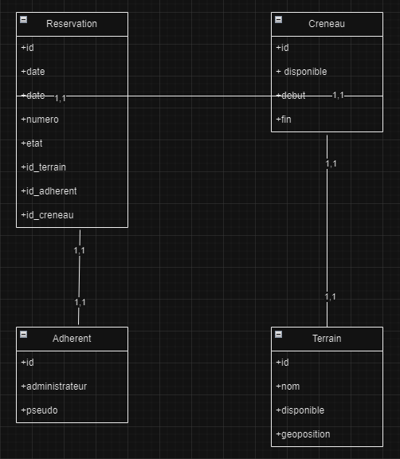

# API de Réservation de Terrains de Badminton

## Table des matières

- [API de Réservation de Terrains de Badminton](#api-de-réservation-de-terrains-de-badminton)
  - [Table des matières](#table-des-matières)
  - [Lancer le projet](#lancer-le-projet)
  - [Conception](#conception)
    - [Dictionnaire des données](#dictionnaire-des-données)
    - [Modèle Conceptuel des Données (MCD)](#modèle-conceptuel-des-données-mcd)
  - [Remarques](#remarques)
  - [Références](#références)
  - [Code source](#code-source)

## Lancer le projet

Pour lancer le projet, suivre les étapes suivantes :

~~~bash
cd api
npm install
npm run swagger-autogen
node app.js
~~~

L'API est exposée sur l'URL  `http://localhost:3000`

Tester l'API :

~~~bash
curl http://localhost:3000
~~~

## Conception

### Dictionnaire des données

| Ressource | URL | Méthodes HTTP | Paramètres d’URL/Variations | Commentaires |
| --- | --- | --- | --- | --- |
| Adhérents | /adherents | GET | disponible (true ou false), pseudo | Récupère la liste des adhérents |
| Adhérent | /adherents/:id | GET | - | Récupère un adhérent par son identifiant |
| Réservations | /admin/reservations | GET | - | Récupère la liste des réservations (admin uniquement) |
| Terrains | /admin/terrains | GET | - | Récupère la liste des terrains (admin uniquement) |
| Terrain | /admin/terrains/:name/disponible | POST | - | Modifie la disponibilité d'un terrain (admin uniquement) |

### Modèle Conceptuel des Données (MCD)

## Remarques

- Les adhérents peuvent consulter la liste des réservations et leur propre profil.
- Les admins peuvent consulter la liste des réservations, la liste des terrains et modifier la disponibilité d'un terrain.
- L'authentification est requise pour accéder aux ressources réservées aux admins.

## Références

- [Express.js](https://expressjs.com/)
- [MySQL](https://www.mysql.com/)
- [Sequelize](https://sequelize.org/)
- [JSON Web Token](https://jwt.io/)
- [HAL](http://stateless.co/hal_specification.html)

## Code source

Le code source de l'API est disponible sur [GitHub](https://github.com/votre-nom-utilisateur/api-badminton).